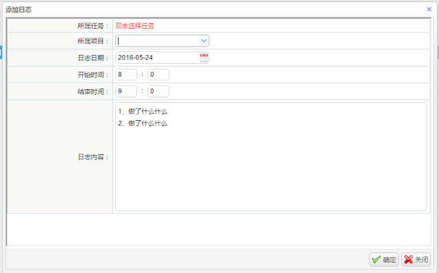
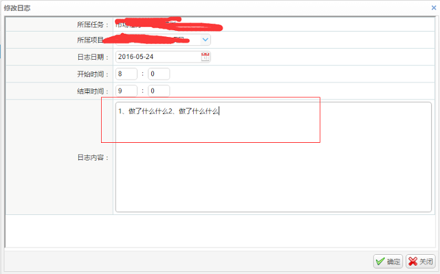

使用`textbox`组件换行保存后，修改的时候还原内容就会失去换行符，看着比较怪异



保存后修改回显如下：



## 解决方法

### 方法一、添加一个隐藏的textarea，然后在js中赋值
```js
// 组件初始化
<input id="LOG_CONTENT" name="LOG_CONTENT" class="easyui-textbox" data-
options="required:true, multiline:true" style="width:100%;height: 200px;">  
// 隐藏的textarea
<textarea style="display: none;" id="LOG_CONTENT_VALUE">${edit.LOG_CONTENT }</textarea>  
//js中赋值
var LOG_CONTENT_VALUE = $("#LOG_CONTENT_VALUE").val();  
$("#LOG_CONTENT").textbox("setValue", LOG_CONTENT_VALUE);
```

### 方法二、直接声明为一个textarea
```js
<textarea id="LOG_CONTENT" name="LOG_CONTENT" class="easyui-textbox" data-
options="required:true, multiline:true" style="width:100%;height: 
200px;">${edit.LOG_CONTENT }</textarea> 
```