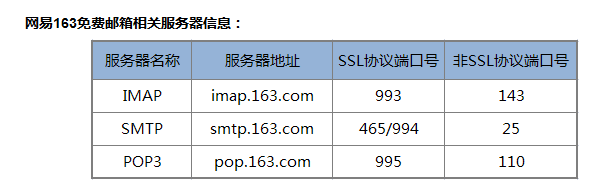
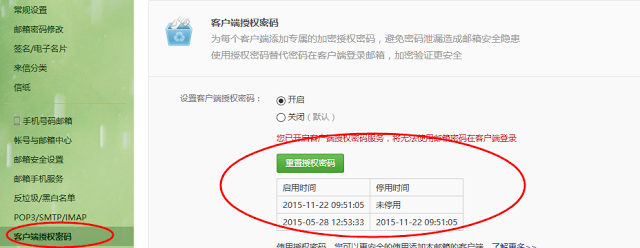
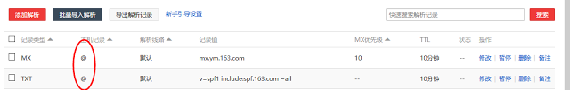
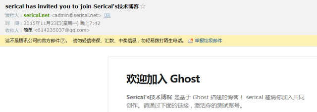

### 一、使用普通网易邮箱
格式如下：
```js
mail: {
    transport: 'SMTP',
    from: '网易邮箱账号',
    options: {
        host: 'smtp.163.com',
        secureConnection: true,
        port: 994,
        auth: {
            user: '网易邮箱账号',
            pass: '必须客户端授权密码'
        }
    }
}
```
网易邮箱协议、地址、端口如下：<br>



关于客户端授权密码：<br>



不知道的请重置然后记下来，只显示一次
### 二、使用网易免费企业邮箱
```js
mail: {
    transport: 'SMTP',
    from: 'xxx.com <xxx@xxx.com>',
    options: {
        host: 'smtp.ym.163.com',
        secureConnection: true,
        port: 994,
        auth: {
            user: 'xxx@xxx.com',
            pass: '登陆密码'
        }
    }
}
```
申请地址：网易免费企业邮箱
需要注意的就是添加MX记录和TXT记录，主机记录不能写mail,域名,改成@才行,如下图： <br>



效果如图：<br>

