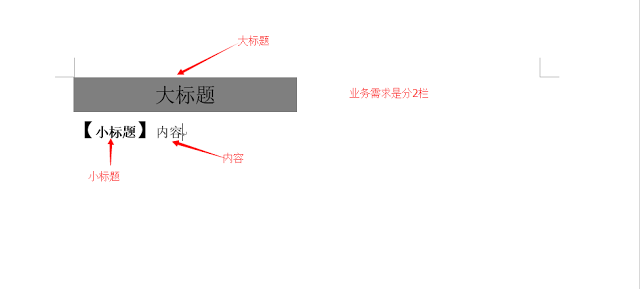
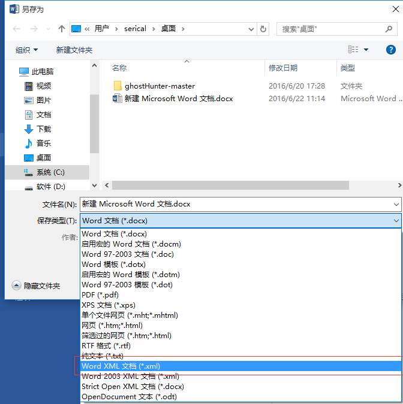
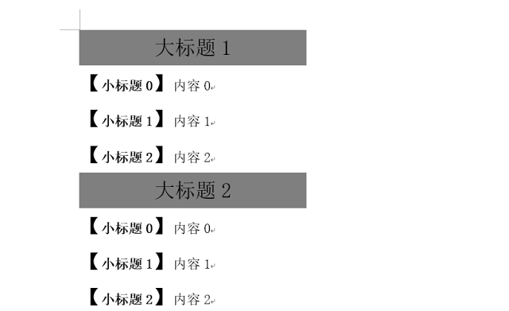

### 一、背景
工作中需要导出word功能，google了一番都推荐freemarker导出word，可以事先在word中定制好模板，另存为模板xml，然后在需要动态的地方使用freemarker语言动态输出。

### 二、实现
1、编辑模板<br>


2、保存模板<br>


3、动态部分使用freemarker输出
这里的模板不能换行，换行后生成的word会报错，虽然也能打开，但是体验不好，复制一份在myeclipse中格式化修改需要动态生成的部分，然后在原模板中做相同的操作，由于xml比较长就不一一显示了。

4、FreeMarker<br>
[jar下载地址](http://www.apache.org/dyn/closer.cgi/incubator/freemarker/engine/2.3.24-incubating/binaries/apache-freemarker-2.3.24-incubating-bin.tar.gz) 
[英文文档](http://freemarker.org/docs/index.html) 
[中文文档](https://sourceforge.net/projects/freemarker/files/chinese-manual/) 
了解API然后就开始下手了
```java
import java.io.File;
import java.io.FileOutputStream;
import java.io.IOException;
import java.io.OutputStreamWriter;
import java.util.ArrayList;
import java.util.HashMap;
import java.util.List;
import java.util.Map;

import freemarker.template.Configuration;
import freemarker.template.Template;

public class WordTest {

    public static void main(String[] args) {
        // 模板根目录
        String path = WordTest.class.getResource("").getFile();
        System.out.println(path);
        FileOutputStream fos = null;
        OutputStreamWriter writer = null;
        try {
            // 导出doc路径
            fos = new FileOutputStream("d:" + File.separator + "test.doc");
            writer = new OutputStreamWriter(fos, "UTF-8");

            Configuration config = new Configuration(
                    Configuration.VERSION_2_3_24);
            config.setDefaultEncoding("UTF-8");
            config.setDirectoryForTemplateLoading(new File(path));
            Template template = config.getTemplate("test.xml", "UTF-8");

            // 构造数据
            Map<String, Object> map = new HashMap<String, Object>();
            List<Map<String, Object>> list = new ArrayList<Map<String, Object>>();
            for (int i = 1; i <= 5; i++) {
                Map<String, Object> m = new HashMap<String, Object>();
                m.put("title", "大标题" + i);
                List<Map<String, Object>> child = new ArrayList<Map<String, Object>>();
                for (int j = 0; j < 3; j++) {
                    Map<String, Object> m1 = new HashMap<String, Object>();
                    m1.put("title", "小标题" + j);
                    m1.put("content", "内容" + j);
                    child.add(m1);
                }
                m.put("child", child);
                list.add(m);
            }
            map.put("datas", list);

            // 导出
            template.process(map, writer);
        } catch (Exception e) {
            e.printStackTrace();
        } finally {
            try {
                writer.close();
            } catch (IOException e) {
                e.printStackTrace();
            }
        }
    }
}
```
5、结果<br>
