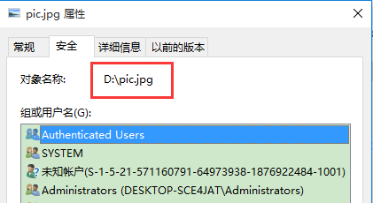

```java
public class Test {

	public static void main(String[] args) {
		String ok = "D:\\pic.jpg"; // 正确路径，鼠标从右往左选到盘符前面，再用Shift+<-选择盘符
		String no = "‪D:\\pic.jpg"; // 错误路径
		for (byte b : ok.getBytes()) {
			System.out.print(b + ",");
		}
		System.out.println();
		for (byte b : no.getBytes()) {
			System.out.print(b + ",");
		}
	}
}

// 输出
68,58,92,112,105,99,46,106,112,103,
-30,-128,-86,68,58,92,112,105,99,46,106,112,103,
```