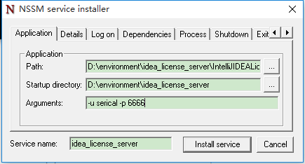
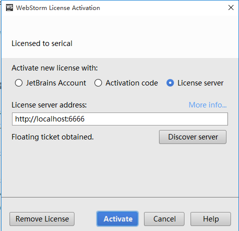

### 一、相关软件
下载`idea_license_server.zip`<br>
[nssm.exe](http://nssm.cc/download)<br>
[IntelliJIDEALicenseServer_windows_amd64.exe](http://blog.lanyus.com/archives/231.html)

### 二、配置服务
解压后，使用`命令提示符（管理员）`进入解压后的目录，执行：
```bash
# 安装服务
nssm.exe install idea_license_server
# 移除服务
nssm.exe remove idea_license_server
```
弹出框如下：<br>
<br>
添加参数自定义用户名、端口
```bash
IntelliJIDEALicenseServer_windows_amd64.exe -help
Usage of IntelliJIDEALicenseServer_windows_amd64.exe:
  -l string
        bind on host (default "0.0.0.0")
  -p int
        port (default 1017)
  -prolongationPeriod string
        prolongationPeriod (default "607875500")
  -u string
        username (default "ilanyu")
```
点击`install service`完成安装
### 三、使用
`Help->Register`<br>
