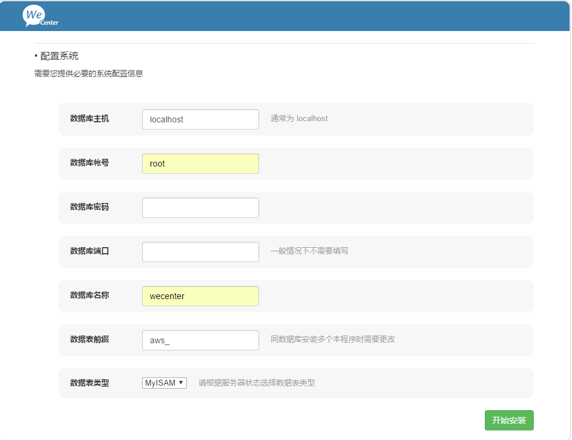

### 准备文件
[WeCenter](https://github.com/wecenter/wecenter/archive/3.1.9.tar.gz)<br>
[xampp](https://www.apachefriends.org/xampp-files/5.6.30/xampp-linux-x64-5.6.30-1-installer.run)

### 安装XAMPP
```bash
# 增加执行权限
[root@localhost ~]# chmod +x xampp-linux-x64-5.6.30-1-installer.run
# 安装xampp，选项都输入Y回车
[root@localhost ~]# ./xampp-linux-x64-5.6.30-1-installer.run

# 进入xampp目录
[root@localhost ~]# cd /opt/lampp/
# 查看默认状态
[root@localhost lampp]# ./xampp status
Version: XAMPP for Linux 5.6.30-1
Apache is running.
MySQL is not running.
ProFTPD is not running.
# 启动 xampp start
[root@localhost lampp]# ./xampp start
Starting XAMPP for Linux 5.6.30-1...
XAMPP: Starting Apache...already running.
XAMPP: Starting MySQL...ok.
XAMPP: Starting ProFTPD...ok.
# 查看状态
[root@localhost lampp]# ./xampp status
Version: XAMPP for Linux 5.6.30-1
Apache is running.
MySQL is running.
ProFTPD is running.
```

### 部署WeCenter
```bash
# 删除htdocs其他文件
[root@localhost htdocs]# rm -rf *
# 解压wecenter移到htdocs目录下
[root@localhost ~]# tar -zxf wecenter-3.1.9.tar.gz
[root@localhost ~]# mv wecenter-3.1.9 wecenter
[root@localhost ~]# cd wecenter
[root@localhost wecenter]# mv * /opt/lampp/htdocs/

# ./ ./system ./system/config 含子目录读写权限
[root@localhost lampp]# chmod 777 htdocs/
[root@localhost htdocs]# chmod 777 system/
[root@localhost htdocs]# chmod 777 -R system/config
```

### 创建数据库
```bash
# 进入bin目录
[root@localhost ~]# cd /opt/lampp/bin/
# 进入mysql
[root@localhost bin]# ./mysql -uroot -p
Enter password:
Welcome to the MariaDB monitor.  Commands end with ; or \g.
Your MariaDB connection id is 3
Server version: 10.1.21-MariaDB Source distribution
Copyright (c) 2000, 2016, Oracle, MariaDB Corporation Ab and others.
Type 'help;' or '\h' for help. Type '\c' to clear the current input statement.
MariaDB [(none)]>
# 创建数据库
MariaDB [(none)]> create database wecenter;
Query OK, 1 row affected (0.00 sec)
```

### 安装WeCenter
访问当前主机IP，进入检测界面，一般没问题，点下一步，配置数据库信息如下图：<br>
<br>
点击`开始安装`即完成安装。
> 您的程序已经安装, 要重新安装请删除 `system/config/install.lock.php`<br>
> 然后删除 安装文件`/install/index.php`

### Centos7以前开机启动
```bash
# 老的方式在Centos7无效
[root@localhost ~]# ln -s /opt/lampp/xampp /etc/init.d/xampp
[root@localhost ~]# chkconfig --add xampp
[root@localhost ~]# chkconfig xampp on
[root@localhost ~]# chkconfig --list xampp
注意：该输出结果只显示 SysV 服务，并不包含原生 systemd 服务。SysV 配置数据可能被原生 systemd 配置覆盖。
      如果您想列出 systemd 服务,请执行 'systemctl list-unit-files'。
      欲查看对特定 target 启用的服务请执行
      'systemctl list-dependencies [target]'。
xampp          	0:关	1:关	2:开	3:开	4:开	5:开	6:关
```

### Centos7开机启动
`/usr/lib/systemd/` (user)登录才能运行<br>
`/lib/systemd/system/` (system)不需要登录就能运行
```bash
[root@localhost ~]# cd /lib/systemd/system
[root@localhost system]# vim xampp.service
```
```bash
[Unit]
Description=xampp
After=network.target

[Service]
Type=forking
ExecStart=/opt/lampp/xampp start
ExecReload=/opt/lampp/xampp restart
ExecStop=/opt/lampp/xampp stop
PrivateTmp=true

[Install]
WantedBy=multi-user.target
```
```bash
# 使用下面脚本管理
[root@localhost system]# systemctl status xampp
[root@localhost system]# systemctl start xampp
[root@localhost system]# systemctl stop xampp
[root@localhost system]# systemctl enable xampp
[root@localhost system]# systemctl disable xampp
```