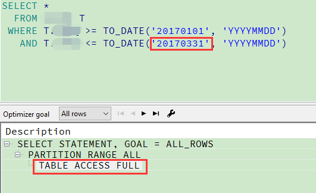
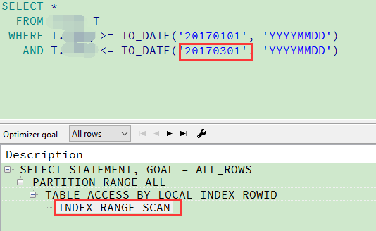
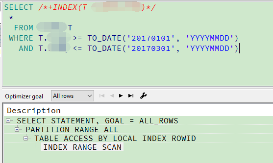

### 一、背景
表`table`有个日期字段`date_time`有索引，但是随着时间段不一样，`查询时间段记录数占总记录数比例不一样`,
有时候走全表扫描，有时候走索引，全表扫描很慢，需要`hint`来指定走索引
### 二、全表扫描
```sql
SELECT *
  FROM TABLE T
 WHERE T.DATE_TIME >= TO_DATE('20170101', 'YYYYMMDD')
   AND T.DATE_TIME <= TO_DATE('20170331', 'YYYYMMDD')
```
全表扫描如下：<br>


### 三、索引扫描
```sql
SELECT *
  FROM TABLE T
 WHERE T.DATE_TIME >= TO_DATE('20170101', 'YYYYMMDD')
   AND T.DATE_TIME <= TO_DATE('20170301', 'YYYYMMDD')
```
索引扫描如下：<br>


### 四、Hint
```sql
SELECT /*+INDEX(T INDEX_DATE_TIME)*/
 *
  FROM TABLE T
 WHERE T.DATE_TIME >= TO_DATE('20170101', 'YYYYMMDD')
   AND T.DATE_TIME <= TO_DATE('20170331', 'YYYYMMDD')
```
结果如下：<br>

### 注意点
`/*+INDEX(T INDEX_DATE_TIME)*/`中要使用表的别名（`T`），否则无效。