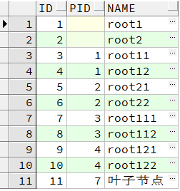
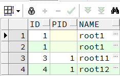
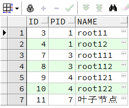

### Oracle递归查询
**基本语法**
```sql
SELECT ... FROM TABLENAME
START BY COND1
CONNECT BY COND2
WHERE COND3
```
**其中：**
* COND1是根结点的限定语句，当然可以放宽限定条件，以取得多个根结点，实际就是多棵树。
* COND2是连接条件，其中用PRIOR表示上一条记录，比如CONNECT BY PRIOR ID=PID就是说上一条记录的ID是本条记录的PID，即本记录的父亲是上一条记录。
* COND3是过滤条件，用于对返回的所有记录进行过滤。
* PRIOR和START WITH关键字是可选项。
* PRIOR运算符必须放置在连接关系的两列中某一个的前面。对于节点间的父子关系，PRIOR运算符在一侧表示父节点，在另一侧表示子节点，从而确定查找树结构是的顺序是自顶向下还是自底向上。在连接关系中，除了可以使用列名外，还允许使用列表达式。
* START WITH子句为可选项，用来标识哪个节点作为查找树型结构的根节点。若该子句被省略，则表示所有满足查询条件的行作为根节点。

```sql
-- 测试表数据
SELECT * FROM TTT T;
```


```sql
-- 递归查询PID=1记录的父节点
SELECT * FROM TTT T
START WITH T.PID = 1
CONNECT BY PRIOR T.PID = T.ID
ORDER BY T.ID;
```


```sql
-- 递归查询PID=1记录的子节点
SELECT * FROM TTT T
START WITH T.PID = 1
CONNECT BY T.PID = PRIOR T.ID
ORDER BY T.ID
```


注意点
PRIOR XXX表示的是满足START WITH条件记录的XXX字段，通过ID或者PID来控制在查询子节点还是父节点。

会查询出多条，比如查询父节点那条SQL，PID=1的有两条，而满足PRIOR PID=ID的也有两条，所有会出现两条PID为NULL的根节点

http://www.ecdoer.com/post/oracle-connect-by.html