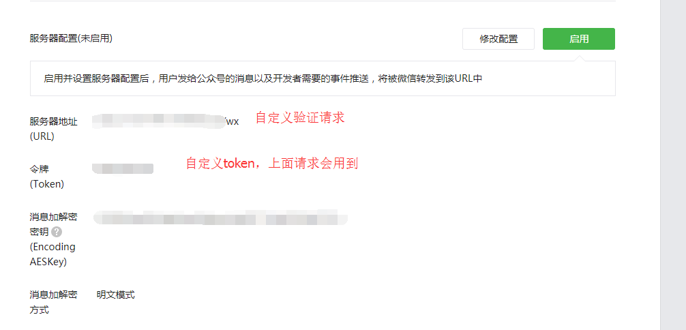
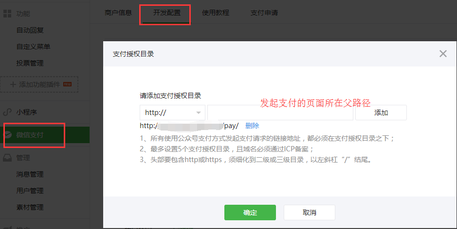
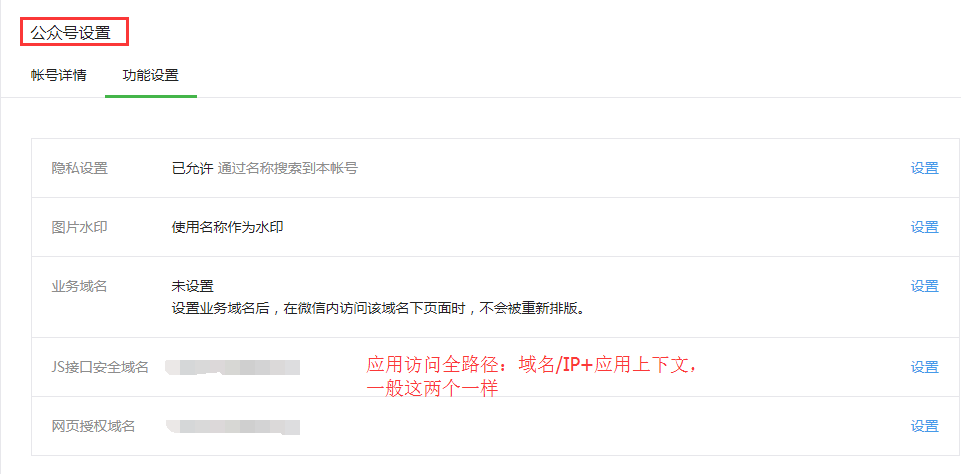

### 第一步 自定义菜单
按要求添加菜单即可
### 第二步 基本配置-服务器配置

### 第三步 微信支付-授权目录

### 第四步 公众号设置-功能设置

### 第五步 配置参数
```ini
# 服务器验证token
token=

# 开发者ID
appid=
# 开发者密码
secret=
# 商户ID
mch_id=
# 商户API秘钥
key=

# 域名|IP地址
host=
```
