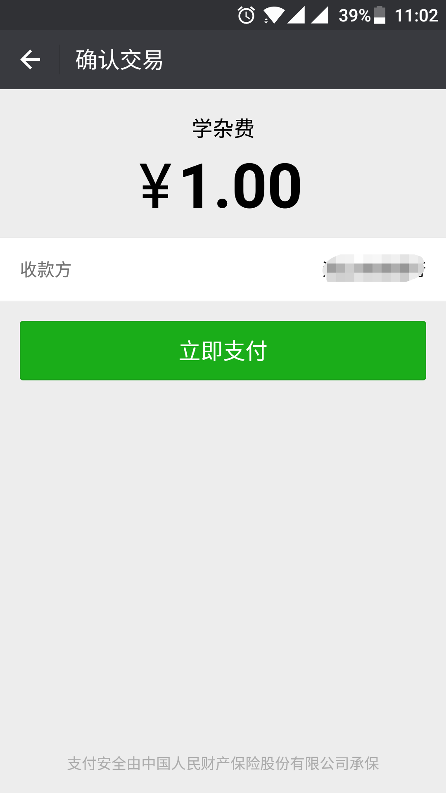

### 一、确认支付父界面跳转
这么做是为了获取用户openid，详情文档：
[网页授权获取用户基本信息 - 微信公众平台开发者文档](https://mp.weixin.qq.com/wiki/4/9ac2e7b1f1d22e9e57260f6553822520.html)
```js
window.location.href = "/Wechat/pay/toPayInfo.do?money="+money+"&type="+type;
```

### 二、微信支付文档
[微信JSSDK说明文档 - 微信公众平台开发者文档](https://mp.weixin.qq.com/wiki/11/74ad127cc054f6b80759c40f77ec03db.html)<br>
主要使用：<br>
**通过config接口注入权限验证配置**
```js
wx.config({
    debug: true, // 开启调试模式,调用的所有api的返回值会在客户端alert出来，若要查看传入的参数，可以在pc端打开，参数信息会通过log打出，仅在pc端时才会打印。
    appId: '', // 必填，公众号的唯一标识
    timestamp: , // 必填，生成签名的时间戳
    nonceStr: '', // 必填，生成签名的随机串
    signature: '',// 必填，签名，见附录1
    jsApiList: [] // 必填，需要使用的JS接口列表，所有JS接口列表见附录2
});
```
**发起一个微信支付请求**
```js
wx.chooseWXPay({
    timestamp: 0, // 支付签名时间戳，注意微信jssdk中的所有使用timestamp字段均为小写。但最新版的支付后台生成签名使用的timeStamp字段名需大写其中的S字符
    nonceStr: '', // 支付签名随机串，不长于 32 位
    package: '', // 统一支付接口返回的prepay_id参数值，提交格式如：prepay_id=***）
    signType: '', // 签名方式，默认为'SHA1'，使用新版支付需传入'MD5'
    paySign: '', // 支付签名
    success: function (res) {
        // 支付成功后的回调函数
    }
});
```
1. 备注：prepay_id 通过微信支付统一下单接口拿到，paySign 采用统一的微信支付 Sign 签名生成方法，
注意这里 appId 也要参与签名，appId 与 config 中传入的 appId 一致，
即最后参与签名的参数有appId, timeStamp, nonceStr, package, signType, `key`。
2. `最坑的就是这里，paySign签名需要key的参加`
### key设置路径：微信商户平台(pay.weixin.qq.com)-->账户设置-->API安全-->密钥设置
3. 请注意该接口只能在你配置的支付目录下调用，同时需确保支付目录在JS接口安全域名下。
4. 微信支付开发文档：https://pay.weixin.qq.com/wiki/doc/api/index.html

### 三、3个签名
**config的signature签名：**<br>
签名算法：[附录1-JS-SDK使用权限签名算法](https://mp.weixin.qq.com/wiki/11/74ad127cc054f6b80759c40f77ec03db.html#.E9.99.84.E5.BD.951-JS-SDK.E4.BD.BF.E7.94.A8.E6.9D.83.E9.99.90.E7.AD.BE.E5.90.8D.E7.AE.97.E6.B3.95)
```java
Map<String, String> signMap = new HashMap<>();
signMap.put("jsapi_ticket", jsapi_ticket);
signMap.put("noncestr", nonceStr);
signMap.put("timestamp", timeStamp);
signMap.put("url", url);
String stringA = SortUtils.sort(signMap);
String signature = EncryptUtils.getSha1(stringA);
```

**prepay_id的sign签名：**<br>
签名算法：[【微信支付】公众号支付开发者文档](https://pay.weixin.qq.com/wiki/doc/api/jsapi.php?chapter=4_3)<br>
```java
Map<String, String> preMap = new HashMap<>();
preMap.put("appid", appid);
preMap.put("body", body);
preMap.put("mch_id", mch_id);
preMap.put("nonce_str", nonceStr);
preMap.put("notify_url", notify_url);
preMap.put("openid", open_id);
preMap.put("out_trade_no", outTradeNo);
preMap.put("spbill_create_ip", spBillCreateIP);
preMap.put("total_fee", total + "");
preMap.put("trade_type", "JSAPI");
String preStringA = SortUtils.sort(preMap) + "&key=" + key;
String sign = EncryptUtils.getMD5(preStringA).toUpperCase();
```

**chooseWXPay的paySign签名：**<br>
签名算法同上
```java
Map<String, String> payMap = new HashMap<>();
payMap.put("appId", appid);
payMap.put("nonceStr", nonceStr);
payMap.put("package", prepay_id);
payMap.put("signType", "MD5");
payMap.put("timeStamp", timeStamp);
// GTMD的腾讯，文档这么写的：
// 备注：prepay_id 通过微信支付统一下单接口拿到，paySign 采用统一的微信支付 Sign 签名生成方法，注意这里 appId 也要参与签名，appId 与 config 中传入的 appId 一致，
// 即最后参与签名的参数有appId, timeStamp, nonceStr, package, signType。
// 微信支付开发文档：https://pay.weixin.qq.com/wiki/doc/api/index.html
// 没说有 + "&key=" + key
String payStringA = SortUtils.sort(payMap) + "&key=" + key;
String paySign = EncryptUtils.getMD5(payStringA).toUpperCase();
```


### 四、PayAction.java
```java
@Controller
@RequestMapping("/pay")
public class PayAction {

	@RequestMapping("/toPayInfo")
	public ModelAndView toPayInfo(HttpServletRequest request) {
		ModelAndView view = new ModelAndView();
		try {
			String money = request.getParameter("money");
			String type = request.getParameter("type");

			String appid = "xxx";
			// 这里直接写回调地址，不能写动态地址，否则redirect_uri参数错误
			String redirect_uri = "http://xxx.xxx/Wechat/pay/payment.jsp"
					+ "?money=" + money + "&type=" + type;
			// 关键（传递中文参数，否则重定向到下一个请求中文参数为null）
			redirect_uri = URLEncoder.encode(redirect_uri, "UTF-8");
			String url = "https://open.weixin.qq.com/connect/oauth2/authorize?appid="
					+ appid
					+ "&redirect_uri="
					+ redirect_uri
					+ "&response_type=code"
					+ "&scope=snsapi_base"
					+ "&state=123#wechat_redirect";

			view.setViewName("redirect:" + url);
		} catch (Exception e) {
			e.printStackTrace();
		}
		return view;
	}

	@ResponseBody
	@RequestMapping("/getPayInfo")
	public Object getPayInfo(HttpServletRequest request) {
		Map<String, Object> map = new HashMap<>();
		try {
			// 初始化参数
			String nonceStr = StringUtil.generateRandomString(16);
			String timeStamp = DateUtils.getCurrentTimestamp() + "";
			String outTradeNo = "NO" + System.currentTimeMillis() / 1000
					+ StringUtil.generateRandomString(6);
			String body = "缴费";
			String spBillCreateIP = ReqUtils.getRealIp(request);

			// request参数
			String money = request.getParameter("money");
			String type = request.getParameter("type");
			String code = request.getParameter("code");

			// 应用参数
			int total = (int) (Float.parseFloat(money) * 100);
			String appid = "xxx";
			String secret = "xxx";
			String mch_id = "xxx";
			String key = "xxx";

			// 获取openid
			String open_url = "https://api.weixin.qq.com/sns/oauth2/access_token?appid="
					+ appid
					+ "&secret="
					+ secret
					+ "&code="
					+ code
					+ "&grant_type=authorization_code";
			JSONObject open_json = JSONObject.fromObject(execute(open_url));
			String open_id = open_json.getString("openid");

			// 获取access_token
			String acct_url = "https://api.weixin.qq.com/cgi-bin/token?grant_type=client_credential&appid="
					+ appid + "&secret=" + secret;
			JSONObject json = JSONObject.fromObject(execute(acct_url));
			String access_token = json.getString("access_token");

			// 获取jsapi_ticket
			String jsapi_url = "https://api.weixin.qq.com/cgi-bin/ticket/getticket?access_token="
					+ access_token + "&type=jsapi";
			JSONObject jsapi_json = JSONObject.fromObject(execute(jsapi_url));
			String jsapi_ticket = jsapi_json.getString("ticket");
			// config签名，url需要动态，否则签名失败
			String url = request.getScheme() + "://" + request.getServerName()
					+ request.getRequestURI() + "?money=" + money + "&type="
					+ type;
			Map<String, String> signMap = new HashMap<>();
			signMap.put("jsapi_ticket", jsapi_ticket);
			signMap.put("noncestr", nonceStr);
			signMap.put("timestamp", timeStamp);
			signMap.put("url", url);
			String stringA = SortUtils.sort(signMap);
			String signature = EncryptUtils.getSha1(stringA);

			// 获取prepay_id
			String prepay_url = "https://api.mch.weixin.qq.com/pay/unifiedorder";
			String notify_url = "http://xxx.xxx/Wechat/pay/notify.do";
			// 计算sign
			Map<String, String> preMap = new HashMap<>();
			preMap.put("appid", appid);
			preMap.put("body", body);
			preMap.put("mch_id", mch_id);
			preMap.put("nonce_str", nonceStr);
			preMap.put("notify_url", notify_url);
			preMap.put("openid", open_id);
			preMap.put("out_trade_no", outTradeNo);
			preMap.put("spbill_create_ip", spBillCreateIP);
			preMap.put("total_fee", total + "");
			preMap.put("trade_type", "JSAPI");
			String preStringA = SortUtils.sort(preMap) + "&key=" + key;
			// 需要转为大写
			String sign = EncryptUtils.getMD5(preStringA).toUpperCase();

			// 组装prepay参数
			StringBuffer params = new StringBuffer();
			params.append("<xml>");
			params.append("<appid>" + appid + "</appid>");
			params.append("<mch_id>" + mch_id + "</mch_id>");
			params.append("<body>" + body + "</body>");
			params.append("<nonce_str>" + nonceStr + "</nonce_str>");
			params.append("<sign>" + sign + "</sign>");
			params.append("<notify_url>" + notify_url + "</notify_url>");
			params.append("<out_trade_no>" + outTradeNo + "</out_trade_no>");
			params.append("<spbill_create_ip>" + spBillCreateIP
					+ "</spbill_create_ip>");
			params.append("<total_fee>" + total + "</total_fee>");
			params.append("<trade_type>JSAPI</trade_type>");
			params.append("<openid>" + open_id + "</openid>");
			params.append("</xml>");
			// 请求prepay_id
			String result_str = execute(prepay_url, params.toString());
			Map<String, String> result = MobiMessage
					.readStringXmlOut(result_str);
			String prepay_id = "prepay_id=" + result.get("prepay_id");
			System.out.println(prepay_id);

			// 计算paySign "appId nonceStr package signType timeStamp"
			Map<String, String> payMap = new HashMap<>();
			payMap.put("appId", appid);
			payMap.put("nonceStr", nonceStr);
			payMap.put("package", prepay_id);
			payMap.put("signType", "MD5");
			payMap.put("timeStamp", timeStamp);
			// GTMD的腾讯，文档这么写的：
			// 备注：prepay_id 通过微信支付统一下单接口拿到，paySign 采用统一的微信支付 Sign 签名生成方法，注意这里 appId 也要参与签名，appId 与 config 中传入的 appId 一致，
			// 即最后参与签名的参数有appId, timeStamp, nonceStr, package, signType。
			// 微信支付开发文档：https://pay.weixin.qq.com/wiki/doc/api/index.html
			// 没说有 + "&key=" + key
			String payStringA = SortUtils.sort(payMap) + "&key=" + key;
			// 需要转为大写
			String paySign = EncryptUtils.getMD5(payStringA).toUpperCase();

			map.put("appId", appid);
			map.put("timeStamp", timeStamp);
			map.put("nonceStr", nonceStr);
			map.put("signature", signature);
			map.put("prepay_id", prepay_id);
			map.put("signType", "MD5");
			map.put("paySign", paySign);
			map.put("money", money);
			map.put("type", type);
		} catch (Exception e) {
			e.printStackTrace();
		}
		return map;
	}

	@ResponseBody
	@RequestMapping("/notify")
	public Object notify(HttpServletRequest request) {
		Map<String, Object> map = RequestParamUtil.handleParamToMap(request);
		System.out.println("notify:" + map);
		return map;
	}

	// 执行HTTP请求
	public String execute(String url) throws Exception {
		CloseableHttpClient client = HttpClientBuilder.create().build();
		HttpPost httpPost = new HttpPost(url);
		// 执行
		HttpResponse response = client.execute(httpPost);
		return EntityUtils.toString(response.getEntity());
	}

	public String execute(String url, String params) throws Exception {
		CloseableHttpClient client = HttpClientBuilder.create().build();
		HttpPost httpPost = new HttpPost(url);
		httpPost.setEntity(new StringEntity(params, "UTF-8"));
		// 执行
		HttpResponse response = client.execute(httpPost);
		return EntityUtils.toString(response.getEntity(), "UTF-8");
	}

}
```

### 四、payment.jsp
引入`<script type="text/javascript" src="http://res.wx.qq.com/open/js/jweixin-1.0.0.js"></script>`
```js
var appId, timestamp, nonceStr, prepay_id, signType, paySign;
$.ajax({
    url: "/Wechat/pay/getPayInfo.do",
    data: {type: '<%=type%>', money: '<%=money%>', code: '<%=code%>'},
    type: "post",
    dataType: "json",
    success: function (data) {
        //console.info(data);
        wx.config({
            debug: true, // 开启调试模式,调用的所有api的返回值会在客户端alert出来，若要查看传入的参数，可以在pc端打开，参数信息会通过log打出，仅在pc端时才会打印。
            appId: data.appId, // 必填，公众号的唯一标识
            timestamp: data.timeStamp, // 必填，生成签名的时间戳
            nonceStr: data.nonceStr, // 必填，生成签名的随机串
            signature: data.signature,// 必填，签名，见附录1
            jsApiList: ['chooseWXPay'] // 必填，需要使用的JS接口列表，所有JS接口列表见附录2
        });

        appId = data.appId;
        timestamp = data.timeStamp;
        nonceStr = data.nonceStr;
        prepay_id = data.prepay_id;
        signType = data.signType;
        paySign = data.paySign;
    }
});

function pay () {
    wx.chooseWXPay({
        timestamp: timestamp, // 支付签名时间戳，注意微信jssdk中的所有使用timestamp字段均为小写。但最新版的支付后台生成签名使用的timeStamp字段名需大写其中的S字符
        nonceStr: nonceStr, // 支付签名随机串，不长于 32 位
        package: prepay_id, // 统一支付接口返回的prepay_id参数值，提交格式如：prepay_id=***）
        signType: signType, // 签名方式，默认为'SHA1'，使用新版支付需传入'MD5'
        paySign: paySign, // 支付签名
        success: function (res) {
            // 支付成功后的回调函数
            alert("success:" + res);
        }
    });
};
```

### 五、SortUtils.java
```java
public class SortUtils {

	/**
	 * key排序连接返回
	 *
	 * @param map
	 * @return
	 */
	public static String sort(Map<String, String> map) {
		StringBuffer sb = new StringBuffer();
		if (null != map && !map.isEmpty()) {
			String[] keys = new String[] {};
			keys = map.keySet().toArray(keys);
			Arrays.sort(keys);
			for (int i = 0; i < keys.length; i++) {
				if (i == 0) {
					sb.append(keys[i] + "=" + map.get(keys[i]));
				} else {
					sb.append("&" + keys[i] + "=" + map.get(keys[i]));
				}
			}
		}
		return sb.toString();
	}

	public static void main(String[] args) {
		Map<String, String> map = new HashMap<>();
		map.put("appId", "1");
		map.put("nonceStr", "2");
		map.put("package", "3");
		map.put("signType", "4");
		map.put("timeStamp", "5");
		System.out.println(sort(map));
	}
}
```

### 六、EncryptUtils.java
```java
public class EncryptUtils {

	public static String getSha1(String str) {
		try {
			StringBuffer sb = new StringBuffer();
			MessageDigest digest = MessageDigest.getInstance("SHA1");
			digest.update(str.getBytes("UTF-8"));
			byte[] md = digest.digest();
			for (int i = 0; i < md.length; i++) {
				String sha = Integer.toHexString(md[i] & 0xFF);
				if (sha.length() < 2) {
					sb.append("0");
				}
				sb.append(sha);
			}
			return sb.toString();
		} catch (Exception e) {
			e.printStackTrace();
			return "";
		}
	}

	public static String getMD5(String str) {
		try {
			StringBuffer sb = new StringBuffer();
			MessageDigest digest = MessageDigest.getInstance("MD5");
			digest.update(str.getBytes("UTF-8"));
			byte[] md = digest.digest();
			for (int i = 0; i < md.length; i++) {
				String sha = Integer.toHexString(md[i] & 0xFF);
				if (sha.length() < 2) {
					sb.append("0");
				}
				sb.append(sha);
			}
			return sb.toString();
		} catch (Exception e) {
			e.printStackTrace();
			return "";
		}
	}
}
```

### 七、效果
